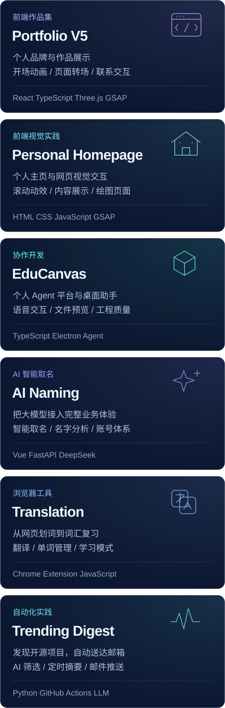

  

  <a href="mailto:1503794397@qq.com"><strong>聊聊你的开发需求 · 1503794397@qq.com</strong></a>

## 你好，我是陈奕恺，也可以叫我 Ethan

我专注于 **AI 应用与全栈开发**，把想法做成可以使用的产品。从前端交互、后端 API 和模型接入，到桌面客户端、自动化流程与部署，我喜欢把整个体验连接起来。

做过 AI 教育与个人助手、智能取名、翻译与词汇学习、开源推荐；也参与团队项目中的智能分析、报告生成与邮件投递。我关注交互体验、异常处理和工程质量，让功能经得起实际使用。

## 做过的产品，留下的代码

<picture>
  <source media="(min-width: 601px)" srcset="assets/projects-desktop.svg">
  
</picture>

[EduCanvas](https://github.com/Timcai06/EduCanvas) / [AI 智能取名](https://github.com/sky-k111/ai-name) / [翻译与学习工具](https://github.com/sky-k111/translation) / [Trending Digest](https://github.com/sky-k111/gh-trending-digest)

**EduCanvas 中的实际贡献：** [桌面助手与语音链路](https://github.com/Timcai06/EduCanvas/pull/369) / [文件预览](https://github.com/Timcai06/EduCanvas/pull/219) / [Agent 成本与时间预算](https://github.com/Timcai06/EduCanvas/pull/291)。

翻译扩展基于 [Timcai06/google-trans-extantion](https://github.com/Timcai06/google-trans-extantion)。

<strong>更多项目与开源参与</strong>

- [my-profile-v5](https://github.com/sky-k111/my-profile-v5)：React、TypeScript、Three.js 与 GSAP 构建的个人作品集。
- [homepage](https://github.com/sky-k111/homepage)：HTML 个人主页与视觉交互实践。
- [dingRobot](https://github.com/thekeyispassion/dingRobot)：提交过多通道接入、管理界面与预约功能扩展提案；相关 PR 尚未合并。[查看提案](https://github.com/thekeyispassion/dingRobot/pull/3)。
- [OpenAI Codex](https://github.com/openai/codex)：通过 [Windows 历史记录问题反馈](https://github.com/openai/codex/issues/41657) 参与产品改进。

## 从界面到交付

| 方向 | 技术 |
| --- | --- |
| 前端与交互 | TypeScript / JavaScript · React · Vue · Tailwind CSS |
| 后端与数据 | Python · FastAPI · Node.js · PostgreSQL · MySQL · SQLite |
| AI 与桌面 | LLM APIs · Agent / RAG · LangGraph · Electron |
| 工程与交付 | Git · Docker · GitHub Actions · pytest · Vitest · Playwright |

## 一起把你的想法做出来

我可以协助开发 **AI 应用与智能助手、网站与业务系统、Electron 桌面工具、Chrome 扩展、自动化流程**，也欢迎讨论现有项目的功能完善、问题修复和部署。

  

**[1503794397@qq.com](mailto:1503794397@qq.com)**

来信告诉我你想解决的问题、期望的功能和时间安排。需求还没整理好，也可以从一个想法开始聊。
